<center>
<h1 style="">Servidor Multitarea</h1>

---


</center>

<style>
@page {
  @bottom-right {
    content: "Jairo Mosteiro – SMR2 | Trabajo Intermodular | 2025";
    font-size: 10pt;
  }
}
</style>


<style>
@page {
  @bottom-center {
    content: counter(page);
  }
}
</style>


<div style="page-break-after: always;"></div>

# Indice:
- [Indice:](#indice)
  - [**Descripcion**](#descripcion)
  - [**Montaje y especificacion de piezas**](#montaje-y-especificacion-de-piezas)
  - [**Software utilizado**](#software-utilizado)
    - [**Servidores Virtualizados**](#servidores-virtualizados)
  - [Ubuntu Server – DNS y DHCP](#ubuntu-server--dns-y-dhcp)
    - [Descripción](#descripción)
    - [Configuración de red del servidor](#configuración-de-red-del-servidor)
    - [Configuración del servidor DHCP](#configuración-del-servidor-dhcp)
    - [Configuración del servidor DNS](#configuración-del-servidor-dns)
  - [Windows Server – Active Directory y GPOs](#windows-server--active-directory-y-gpos)
    - [Descripción](#descripción-1)
    - [Instalación de Windows Server](#instalación-de-windows-server)
    - [Configuración inicial del servidor](#configuración-inicial-del-servidor)
    - [Creación del dominio](#creación-del-dominio)
    - [Unidades Organizativas y Usuarios](#unidades-organizativas-y-usuarios)
    - [Políticas de Grupo (GPOs)](#políticas-de-grupo-gpos)
  - [Windows Client – Unión al dominio y aplicación de GPOs](#windows-client--unión-al-dominio-y-aplicación-de-gpos)
    - [Descripción](#descripción-2)
    - [Configuración del cliente](#configuración-del-cliente)
    - [Verificación de las GPOs en el cliente](#verificación-de-las-gpos-en-el-cliente)
    - [Resultado final](#resultado-final)
  - [Automatización con Ansible](#automatización-con-ansible)
    - [Descripción](#descripción-3)
    - [¿Qué es Ansible?](#qué-es-ansible)
    - [¿Por qué se usa Ansible?](#por-qué-se-usa-ansible)
    - [Infraestructura](#infraestructura)
    - [Estructura del Proyecto](#estructura-del-proyecto)
    - [Instalación y Configuración](#instalación-y-configuración)
      - [Paso 1: Crear estructura del proyecto](#paso-1-crear-estructura-del-proyecto)
      - [Paso 2: Configurar ansible.cfg](#paso-2-configurar-ansiblecfg)
      - [Paso 3: Definir inventario](#paso-3-definir-inventario)
      - [Paso 4: Instalar Ansible](#paso-4-instalar-ansible)
      - [Paso 5: Verificar conectividad](#paso-5-verificar-conectividad)
      - [Paso 6: Crear el playbook](#paso-6-crear-el-playbook)
      - [Paso 7: Instalar dependencias](#paso-7-instalar-dependencias)
    - [Ejecución del Playbook](#ejecución-del-playbook)
      - [Ejecución en tiempo real](#ejecución-en-tiempo-real)
      - [Verificación en Proxmox](#verificación-en-proxmox)
    - [Validación de Funcionamiento](#validación-de-funcionamiento)
      - [Acceso SSH](#acceso-ssh)
      - [Verificación interna](#verificación-interna)
    - [Resultados](#resultados)
    - [Ventajas de esta Automatización](#ventajas-de-esta-automatización)
  - [pfSense – Firewall y seguridad de red](#pfsense--firewall-y-seguridad-de-red)
    - [Descripción](#descripción-4)
    - [Instalación de pfSense](#instalación-de-pfsense)
      - [Primer arranque](#primer-arranque)
      - [Proceso de instalación](#proceso-de-instalación)
    - [Configuración inicial de interfaces (Consola)](#configuración-inicial-de-interfaces-consola)
      - [Detección de interfaces](#detección-de-interfaces)
      - [Sistema arrancado – menú principal](#sistema-arrancado--menú-principal)
      - [Configuración de IP estática en la interfaz WAN](#configuración-de-ip-estática-en-la-interfaz-wan)
      - [Instalación de Tailscale](#instalación-de-tailscale)
    - [Configuración via WebConfigurator](#configuración-via-webconfigurator)
      - [Paso 1: Bienvenida al asistente](#paso-1-bienvenida-al-asistente)
      - [Paso 2: Información general](#paso-2-información-general)
      - [Paso 3: Servidor de tiempo (NTP)](#paso-3-servidor-de-tiempo-ntp)
      - [Paso 4: Configuración de la interfaz WAN](#paso-4-configuración-de-la-interfaz-wan)
      - [Paso 5: Contraseña de administrador](#paso-5-contraseña-de-administrador)
      - [Paso 6: Asistente completado](#paso-6-asistente-completado)
    - [Dashboard](#dashboard)
    - [Configuración del Firewall – Reglas WAN](#configuración-del-firewall--reglas-wan)
      - [Regla 1: Permitir DNS desde WAN al servidor Ubuntu](#regla-1-permitir-dns-desde-wan-al-servidor-ubuntu)
      - [Regla 2: Permitir SSH al servidor Ubuntu](#regla-2-permitir-ssh-al-servidor-ubuntu)
      - [Regla 3: Denegación por defecto](#regla-3-denegación-por-defecto)
    - [Resultado final de las reglas](#resultado-final-de-las-reglas)
  - [Web – Página corporativa con Web4Pro](#web--página-corporativa-con-web4pro)
    - [Descripción](#descripción-5)
    - [Layout de la página](#layout-de-la-página)
  - [**Conclusion**](#conclusion)
  - [**Glosario**](#glosario)
    - [Hardware](#hardware)

<div style="page-break-after: always;"></div>

## **Descripcion** 

- Este proyecto consiste en el diseño e implementación de un servidor multitarea orientado a pequeñas y medianas empresas (PYMES), cuyo objetivo principal es ofrecer una solución integral, económica y funcional para la gestión de los servicios básicos de una red empresarial.

- La infraestructura del servidor se compone de varios sistemas y servicios que trabajan de forma conjunta. En primer lugar, se utiliza proxmox para virtualizar los SO, pfsense como firewall, un servidor basado en Ubuntu Server, encargado de proporcionar los servicios de DNS (Domain Name System) y DHCP (Dynamic Host Configuration Protocol). Estos servicios permiten, respectivamente, la correcta resolución de nombres dentro de la red y la asignación automática de direcciones IP a los dispositivos conectados, facilitando así la administración y organización de la red interna de la empresa.

- Además, el proyecto incorpora un servidor Windows Server sobre el cual se configura Active Directory Domain Services (AD DS) junto con Políticas de Grupo (GPOs), que permiten gestionar de forma centralizada los equipos y usuarios que forman parte del dominio empresarial.

- Un aspecto destacado del proyecto es que todo el hardware utilizado es de segunda mano o reciclado, lo que reduce significativamente los costes de implementación y fomenta la sostenibilidad y el aprovechamiento de recursos. De este modo, el servidor se presenta como una alternativa accesible para pequeñas empresas que no disponen de un gran presupuesto tecnológico.

- En conjunto, este servidor multitarea permite a la empresa que lo implemente disponer de gestión de red, servicios web, bases de datos y seguridad, todo centralizado en una única infraestructura, contribuyendo a mejorar la eficiencia, el control y la fiabilidad de su entorno informático.

<div style="page-break-after: always;"></div>

## **Montaje y especificacion de piezas**

- Las piezas que componen este servidor han sido recicladas de otros equipos informáticos o adquiridas de segunda mano. Es importante destacar este aspecto, ya que optar por este tipo de soluciones contribuye a un futuro más sostenible, reduciendo la generación de residuos electrónicos y fomentando la reutilización de hardware que aún se encuentra en buen estado de funcionamiento.

- Además del impacto positivo a nivel medioambiental, el uso de componentes reciclados supone una reducción significativa de costes en comparación con la compra de hardware nuevo. Para pequeñas y medianas empresas, este factor resulta clave, ya que permite disponer de una infraestructura funcional sin necesidad de realizar una gran inversión inicial. Si los componentes cumplen correctamente su función y no presentan problemas de rendimiento o estabilidad, darles una segunda vida útil es una opción totalmente válida y recomendable.

- El equipo servidor cuenta con los siguientes componentes principales:

- Unidad de almacenamiento SSD de 500 GB, destinada al sistema operativo y a los servicios principales, lo que garantiza tiempos de arranque rápidos y un buen rendimiento general.

- Procesador AMD Ryzen 5 3400G, que ofrece un equilibrio adecuado entre potencia y eficiencia energética, siendo suficiente para tareas de servidor, virtualización ligera y servicios de red.

- 32 GB de memoria RAM DDR4, cantidad más que adecuada para soportar múltiples servicios simultáneos y garantizar la estabilidad del sistema.

- Fuente de alimentación (PSU) de 750 W con certificación 80 Plus Bronze, que asegura una eficiencia energética aceptable y un suministro eléctrico estable para todos los componentes.

- Placa base Gigabyte GA-AB350-Gaming 3, compatible con el procesador utilizado y adecuada para la ampliación y reutilización en entornos de laboratorio o servidor.

- Para facilitar la identificación y comprensión del hardware empleado, se adjuntan imágenes de todos los componentes principales del equipo en el apartado de [**Glosario**](#glosario) de este proyecto.

- Por último, el gabinete del servidor ha sido reutilizado de un ordenador antiguo que iba a ser desechado. De este modo, se ha intentado aprovechar al máximo las piezas disponibles que dicho equipo podía ofrecer, reforzando aún más la filosofía de reutilización y sostenibilidad que caracteriza a este proyecto.

<div style="page-break-after: always;"></div>

## **Software utilizado**

- El SO utilizado en este servidor es Proxmox y tomé esta decisión basándome en la facilidad para instalar herramientas y porque suelo tener más afinidad con la shell de Linux que con el CMD de Windows, y porque me parecía una opción más realista a la hora de lo que verdaderamente se utiliza en el mundo empresarial.

  ### **Servidores Virtualizados**
  
  En este apartado hablaré sobre los servidores virtualizados que tenemos en nuestro servidor principal y el porqué he escogido cada uno de estos para cada tarea.

<div style="page-break-after: always;"></div>

---

## Ubuntu Server – DNS y DHCP

### Descripción

Ubuntu Server es el sistema operativo elegido para gestionar los servicios de red más básicos pero fundamentales de la infraestructura: **DNS** y **DHCP**. La elección de Ubuntu Server se debe a su estabilidad, su amplia comunidad de soporte, la facilidad de administración mediante terminal y la disponibilidad de paquetes como `bind9` (DNS) e `isc-dhcp-server` (DHCP) en sus repositorios oficiales.

- El servicio **DHCP** permite que cualquier equipo que se conecte a la red empresarial reciba automáticamente una dirección IP, máscara de subred, puerta de enlace y servidor DNS, eliminando la necesidad de configuración manual en cada dispositivo.

- El servicio **DNS** permite traducir nombres de dominio a direcciones IP y viceversa, facilitando la comunicación dentro de la red interna y el acceso a Internet.

---

### Configuración de red del servidor

Antes de instalar los servicios, se configuró una IP estática en el servidor Ubuntu para que siempre sea accesible desde la misma dirección dentro de la red.

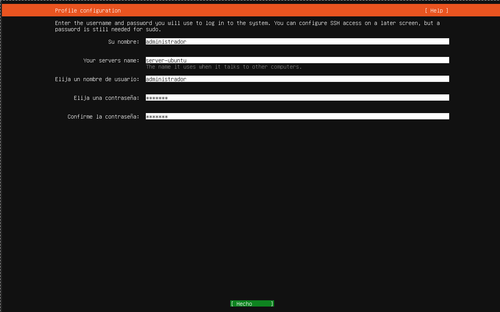

> Configuración inicial de la interfaz de red del servidor Ubuntu.

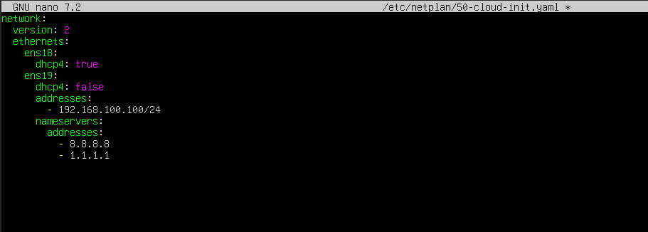

> Verificación de la interfaz y asignación de IP estática mediante Netplan.

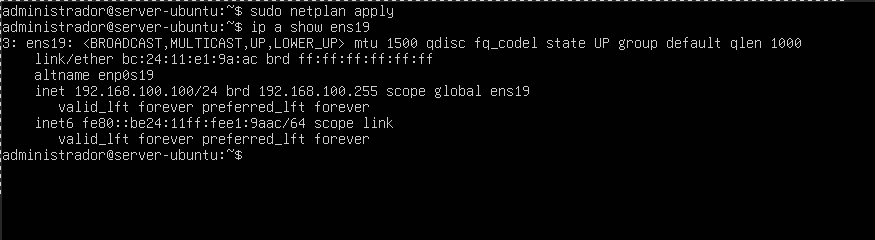

> Aplicación de la configuración de red con `netplan apply`.

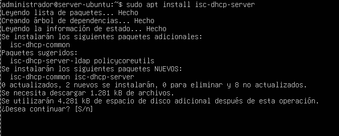

> Comprobación de conectividad y resolución de nombres tras aplicar la configuración.

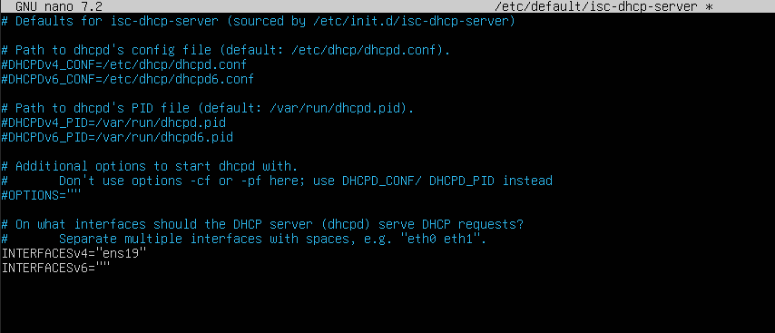

> Estado final de la interfaz de red con la IP estática asignada correctamente.

---

### Configuración del servidor DHCP

Para la instalación del servicio DHCP se utilizó el paquete `isc-dhcp-server`. Se configuró el rango de IPs que se asignarán automáticamente a los clientes, la puerta de enlace, el DNS y el tiempo de concesión.

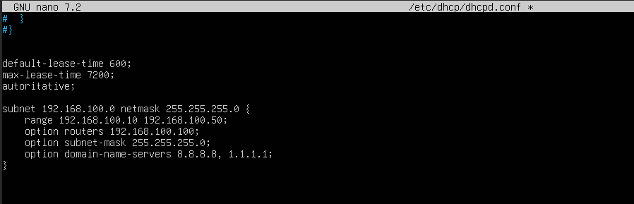

> Configuración del archivo `/etc/dhcp/dhcpd.conf` con el rango de IPs, la subred y los parámetros de red entregados a los clientes.

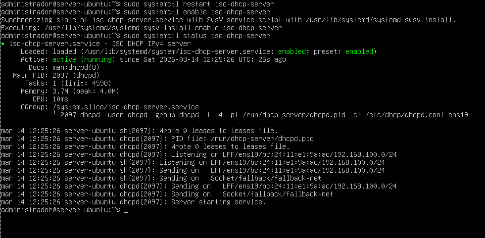

> Inicio y verificación del estado del servicio `isc-dhcp-server` para confirmar que está activo y funcionando correctamente.

---

### Configuración del servidor DNS

Para el servidor DNS se instaló el paquete `bind9`. Se configuraron las zonas directa e inversa para el dominio interno de la empresa, de modo que los equipos puedan resolver nombres internos y también tener salida a Internet.

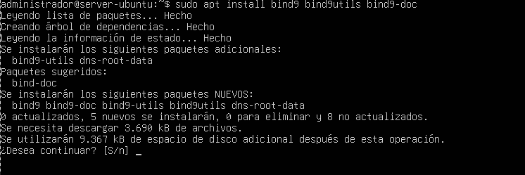

> Instalación del paquete `bind9` y utilidades asociadas.

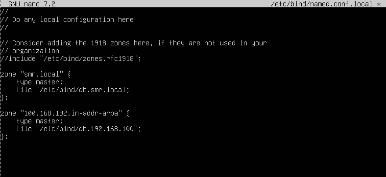

> Configuración del archivo `/etc/bind/named.conf.local` con la declaración de las zonas directa e inversa.

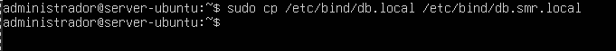

> Configuración del archivo `/etc/bind/named.conf.options` con los reenviadores DNS (forwarders) para la resolución externa.

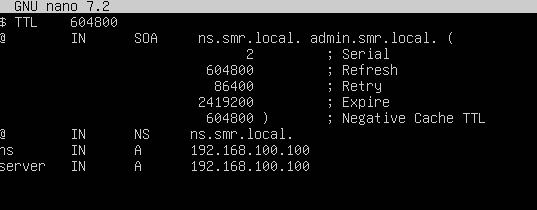

> Creación del archivo de zona directa con los registros A, NS y CNAME necesarios.

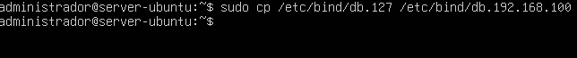

> Creación del archivo de zona inversa con los registros PTR para la resolución inversa.

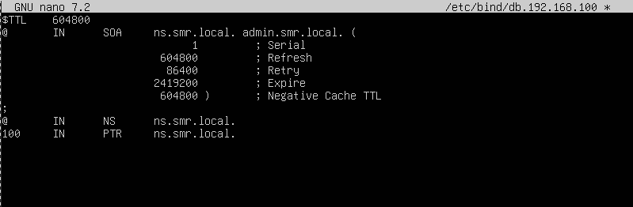

> Verificación de la sintaxis de los archivos de zona con `named-checkzone`.

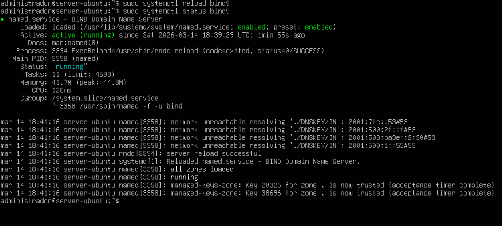

> Reinicio del servicio `bind9` y comprobación de su estado.

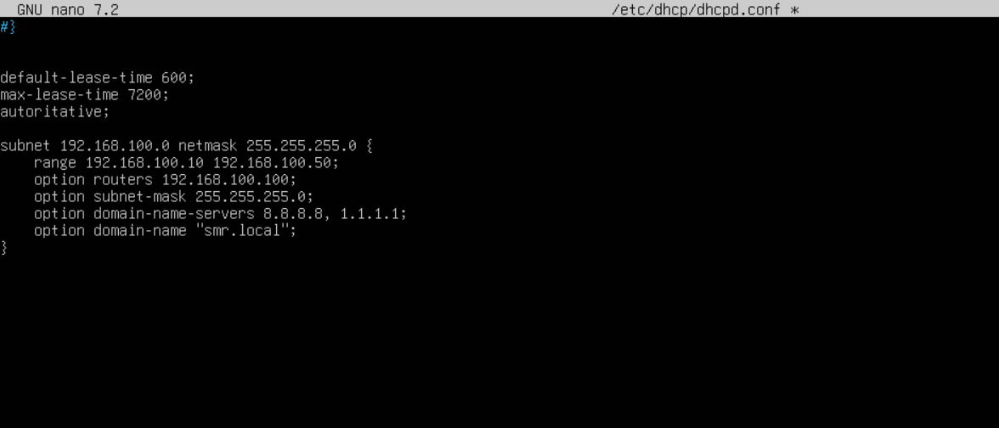

> Prueba de resolución DNS directa con el comando `nslookup` desde un cliente.

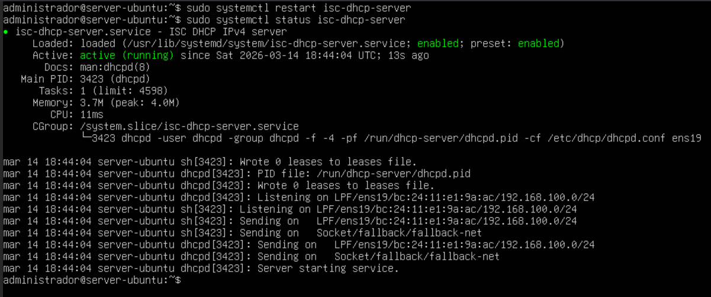

> Prueba de resolución DNS inversa, comprobando que una IP se traduce correctamente al nombre del host.

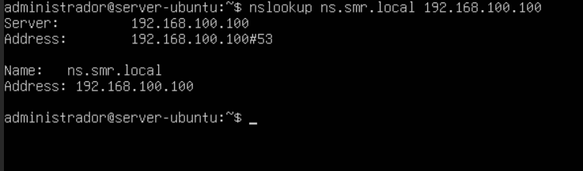

> Verificación final de conectividad completa entre cliente y servidor usando los servicios DNS y DHCP configurados.

<div style="img/page-break-after: always;"></div>

---

## Windows Server – Active Directory y GPOs

### Descripción

Windows Server es el sistema operativo utilizado para gestionar el entorno de directorio activo de la empresa. Mediante **Active Directory Domain Services (AD DS)** se centraliza la autenticación y autorización de todos los usuarios y equipos de la red. Las **Políticas de Grupo (GPOs)** permiten aplicar configuraciones de seguridad, restricciones y personalizaciones de forma automatizada a todos los equipos del dominio.

La elección de Windows Server para este rol se debe a que es el estándar de la industria para entornos empresariales basados en Windows, y su integración nativa con Active Directory lo convierte en la opción más coherente para gestionar un dominio de equipos Windows.

---

### Instalación de Windows Server

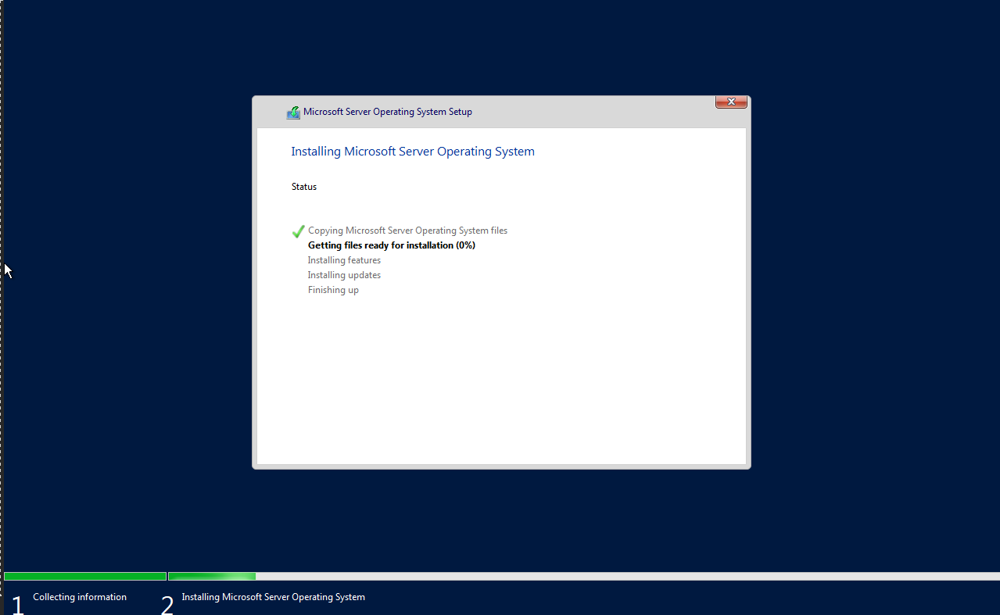

> Proceso de instalación de Windows Server. Se selecciona la versión con experiencia de escritorio para facilitar la administración visual.

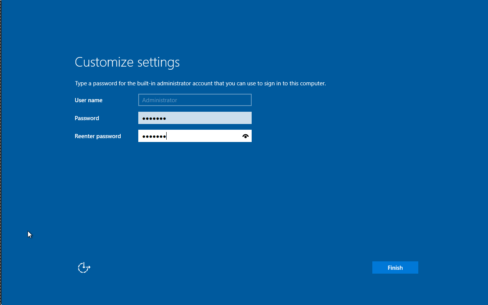

> Finalización de la instalación y primer inicio del sistema operativo.

---

### Configuración inicial del servidor

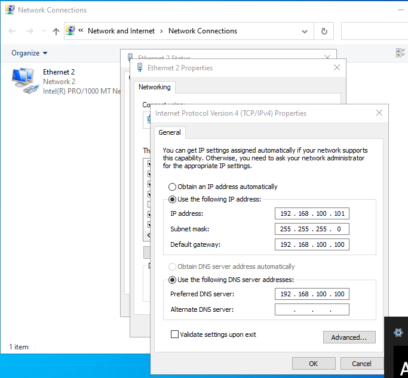

> Configuración de la IP estática del servidor Windows Server. Es imprescindible que el servidor tenga siempre la misma IP para que los clientes puedan localizarlo en la red.

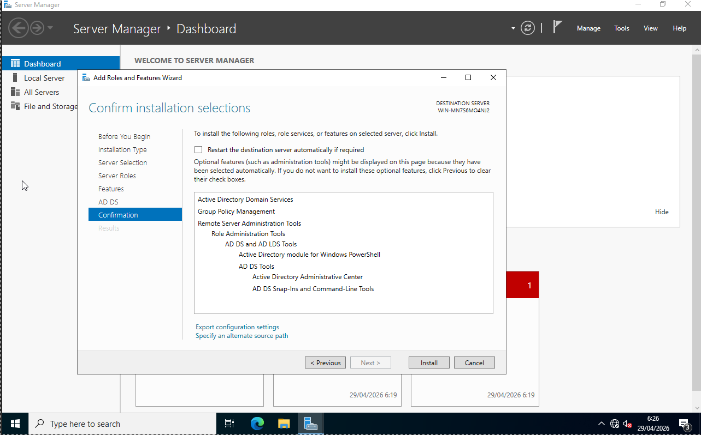

> Configuración del nombre del servidor y verificación de la conectividad de red antes de proceder con la instalación del rol de Active Directory.

---

### Creación del dominio

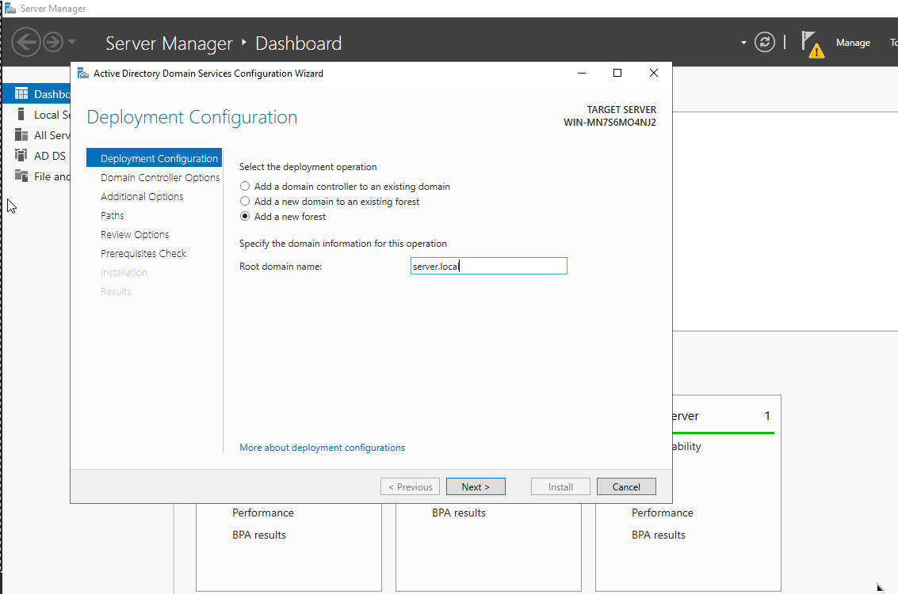

> Instalación del rol **Active Directory Domain Services** desde el Administrador del Servidor. Este rol es el núcleo de toda la infraestructura de directorio.


> Promoción del servidor a **Controlador de Dominio** y creación del nuevo bosque/dominio. Se especifica el nombre del dominio interno de la empresa (por ejemplo, `empresa.local`).

---

### Unidades Organizativas y Usuarios

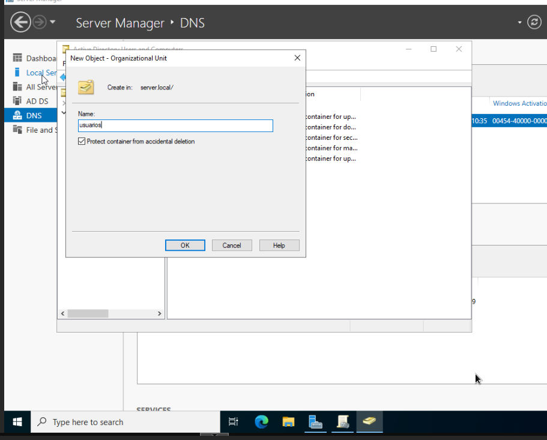

> Creación de **Unidades Organizativas (OUs)** en Active Directory Users and Computers. Las OUs permiten organizar los objetos del directorio (usuarios, equipos, grupos) de forma jerárquica, facilitando la aplicación de GPOs específicas a cada departamento o grupo.

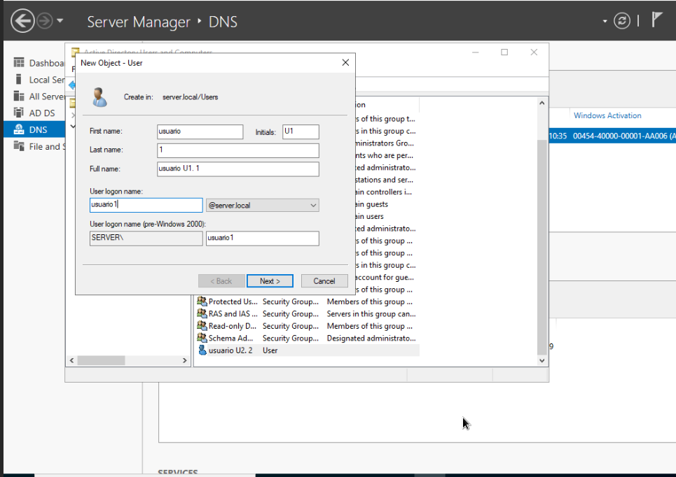

> Creación de cuentas de usuario dentro de las Unidades Organizativas correspondientes. Cada usuario tiene sus credenciales de acceso al dominio y pertenece al grupo o departamento adecuado.

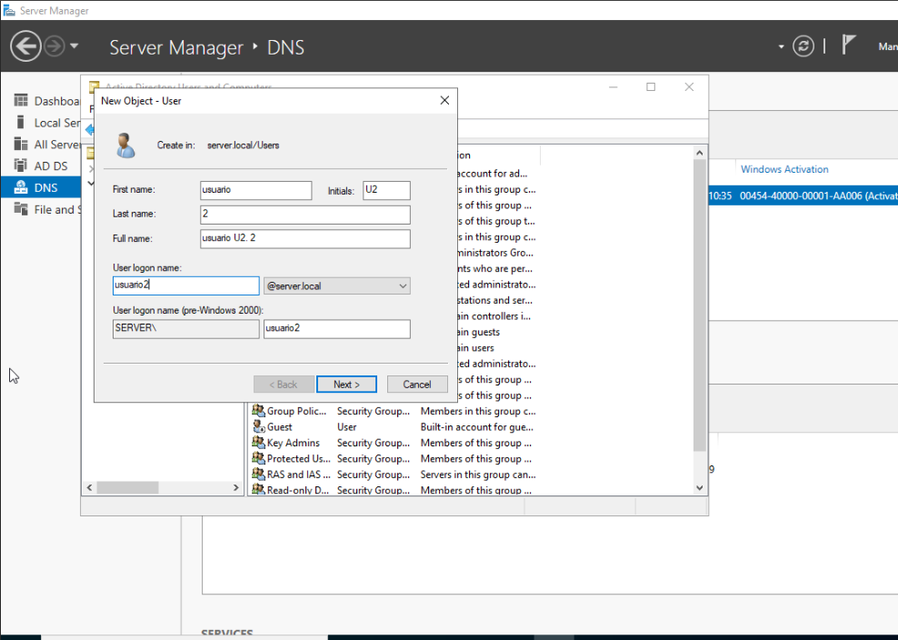

> Verificación de los usuarios creados y sus propiedades: grupo de pertenencia, ruta de perfil y configuración de contraseña.

---

### Políticas de Grupo (GPOs)

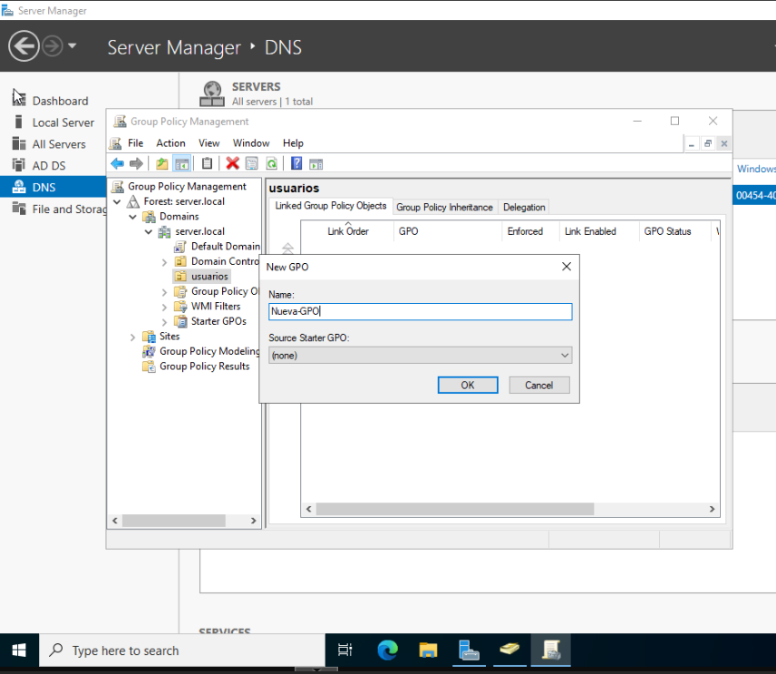

> Creación de una nueva **GPO (Group Policy Object)** desde la Consola de Administración de Directivas de Grupo (GPMC). La GPO se vincula a la Unidad Organizativa correspondiente para que se aplique a todos los equipos y usuarios de ese contenedor.

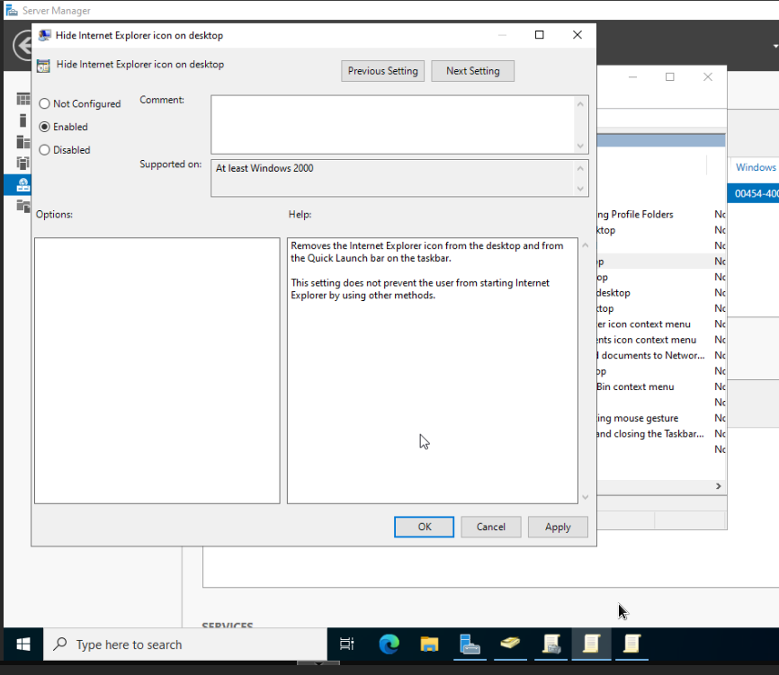

> Edición de la GPO con las políticas de seguridad y configuración deseadas: restricciones de escritorio, configuración de fondo de pantalla corporativo, bloqueo de acceso al panel de control, entre otras. Estas políticas se aplicarán automáticamente cada vez que un usuario inicie sesión en un equipo del dominio.

<div style="page-break-after: always;"></div>

---

## Windows Client – Unión al dominio y aplicación de GPOs

### Descripción

El cliente Windows es un equipo de escritorio que se une al dominio creado en Windows Server. Una vez integrado en el dominio, el cliente recibe automáticamente las Políticas de Grupo configuradas en el servidor, permitiendo una gestión centralizada de su configuración y seguridad sin necesidad de intervención manual en cada equipo.

---

### Configuración del cliente

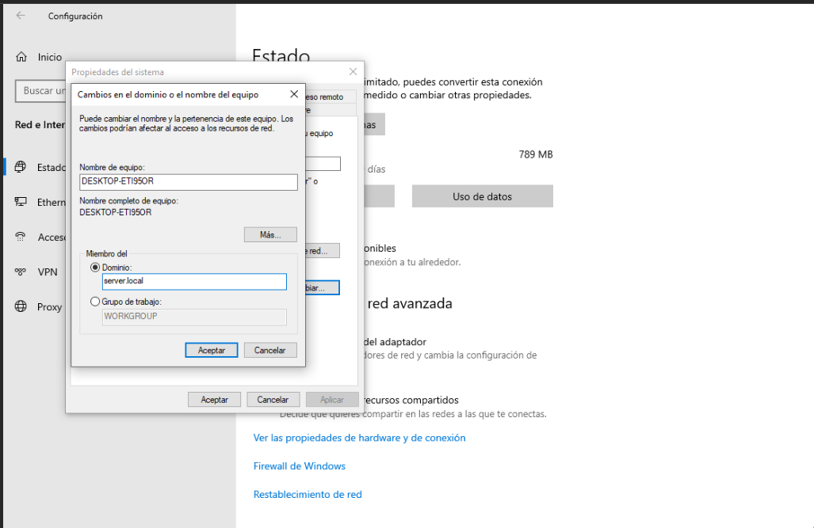

> Configuración del cliente Windows para que utilice la IP del servidor Windows Server como **DNS primario**. Este paso es imprescindible para que el cliente pueda resolver el nombre del dominio y unirse a él.

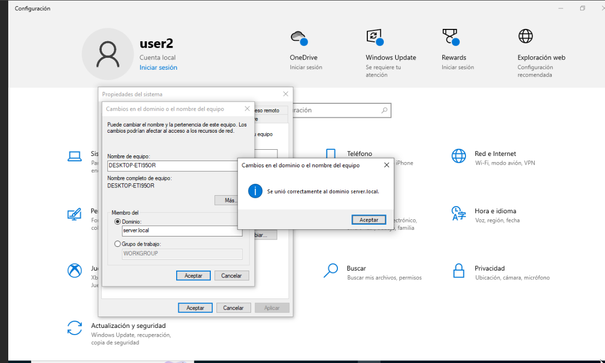

> Proceso de **unión al dominio** desde el cliente: en Propiedades del Sistema se especifica el nombre del dominio (`empresa.local`) y se introducen las credenciales de un administrador del dominio para autorizar la unión.

---

### Verificación de las GPOs en el cliente

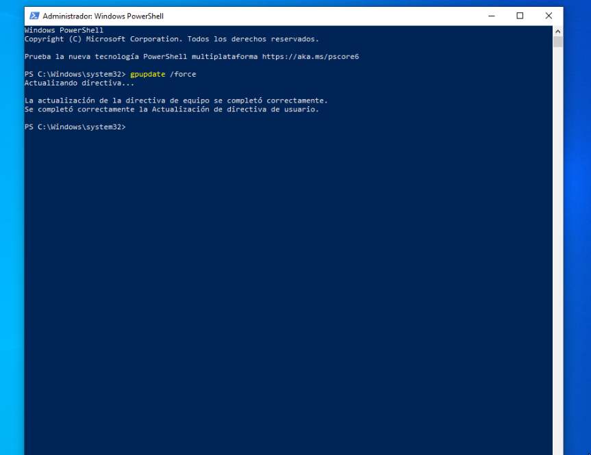

> Comprobación de las GPOs aplicadas en el cliente mediante el comando `gpresult /r`. Se puede observar que las políticas definidas en el servidor se han aplicado correctamente al equipo cliente tras su incorporación al dominio.

---

### Resultado final

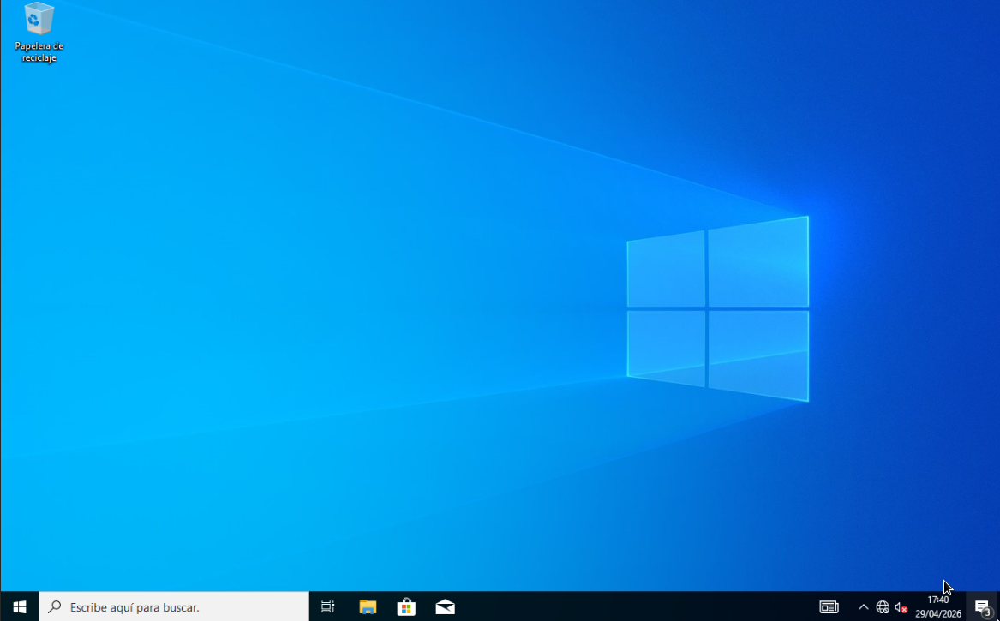

> Resultado final: el cliente ha iniciado sesión correctamente con un usuario del dominio y se observa que las políticas de grupo están activas (fondo de pantalla corporativo, restricciones configuradas, etc.), confirmando que toda la infraestructura de Active Directory funciona correctamente de extremo a extremo.

<div style="page-break-after: always;"></div>

---

## Automatización con Ansible

### Descripción

Ansible es una herramienta de automatización de infraestructura que permite provisionar, configurar y gestionar múltiples máquinas de forma centralizada mediante código declarativo. En este proyecto se implementa un playbook que automatiza completamente la creación de 3 máquinas virtuales Ubuntu Server en Proxmox.

### ¿Qué es Ansible?

Ansible es un orquestador de infraestructura (Infrastructure as Code) que funciona de forma agentless, es decir, no requiere software adicional en los hosts remotos. Utiliza SSH o APIs locales para ejecutar tareas definidas en archivos YAML llamados playbooks.

### ¿Por qué se usa Ansible?

Ansible es ampliamente utilizado en entornos empresariales y de seguridad por varias razones:

- **Automatización**: Reduce tareas repetitivas de 45 minutos a 5 minutos
- **Reproducibilidad**: Las mismas configuraciones se aplican de forma idéntica cada vez
- **Escalabilidad**: Un mismo playbook funciona para 1 máquina o 100
- **Seguridad**: Gestión centralizada de configuraciones y policies
- **Infrastructure as Code**: Las configuraciones se versionan como código
- **Demanda laboral**: Skill crítica en roles de Security Engineer, DevOps y administración de sistemas

### Infraestructura

La automatización se ejecuta sobre la siguiente infraestructura:

- **Hipervisor**: Proxmox VE (nodo pve) en 192.168.1.100
- **Template base**: Ubuntu Server 22.04 LTS (VMID 500)
- **Máquinas a crear**: 3 VMs (VMID 200, 201, 202)
- **Red**: vmbr0 (192.168.1.0/24)
- **Recursos**: 2 CPUs, 2GB RAM, 20GB disco por VM

### Estructura del Proyecto

ansible-proyecto/
├── ansible.cfg
├── inventory/
│   └── proxmox.yml
├── playbooks/
│   └── ubuntu-vms.yml
└── AUTOMATIZACION.md

**ansible.cfg**: Archivo de configuración global que define el comportamiento de Ansible (desactiva verificación de SSH keys, define ubicación del inventario, desactiva warnings innecesarios).

**inventory/proxmox.yml**: Define los hosts con los que Ansible va a interactuar (en este caso, el servidor Proxmox con sus credenciales).

**playbooks/ubuntu-vms.yml**: Playbook principal que define todas las tareas a ejecutar (clonar template, arrancar VMs, configurar red).

### Instalación y Configuración

#### Paso 1: Crear estructura del proyecto

Se crea la carpeta principal `ansible-proyecto` con las subcarpetas necesarias:

> Estructura de directorios creada

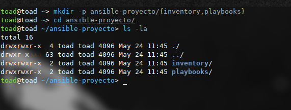

#### Paso 2: Configurar ansible.cfg

Se crea el archivo `ansible.cfg` que define la configuración global:

> Archivo ansible.cfg con configuración global

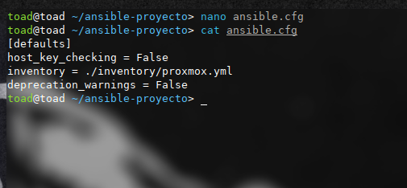

Los parámetros principales son:
- `host_key_checking = False`: No solicita confirmación SSH la primera conexión
- `inventory = ./inventory/proxmox.yml`: Ubicación del inventario
- `deprecation_warnings = False`: Desactiva advertencias innecesarias

#### Paso 3: Definir inventario

Se crea `inventory/proxmox.yml` que contiene los datos del servidor Proxmox:

> Inventario de Proxmox (datos sensibles censurados)

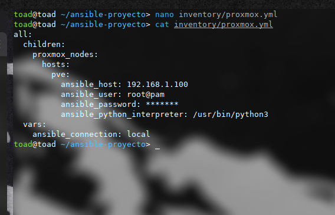

El inventario define:
- Host: pve (Proxmox)
- IP: 192.168.1.100
- Usuario: root@pam
- Método de conexión: Local (API directa)

#### Paso 4: Instalar Ansible

Se instala Ansible y las colecciones necesarias para trabajar con Proxmox:

> Instalación de Ansible y dependencias

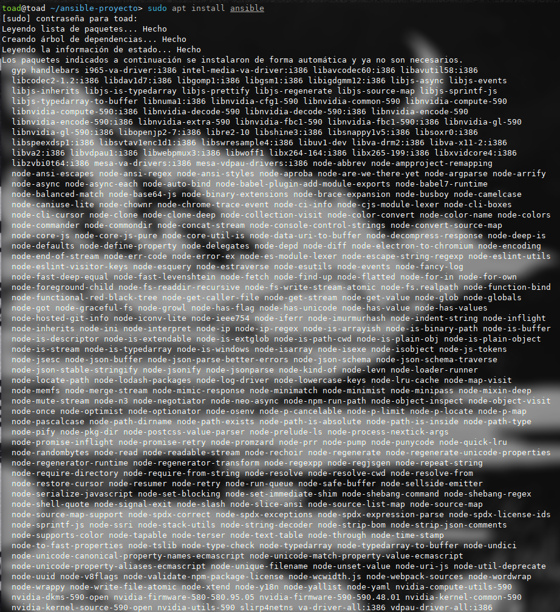

```bash
sudo apt install ansible -y
ansible-galaxy collection install community.general
```

#### Paso 5: Verificar conectividad

Se verifica que Ansible pueda conectar correctamente con Proxmox:

> Verificación de conexión exitosa a Proxmox

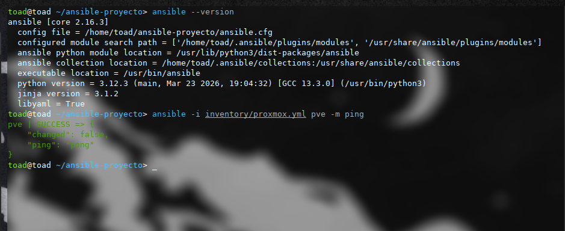

```bash
ansible -i inventory/proxmox.yml pve -m ping
# Resultado esperado: pong (SUCCESS)
```

#### Paso 6: Crear el playbook

Se define `playbooks/ubuntu-vms.yml` con las tareas a ejecutar:

> Contenido del playbook de automatización

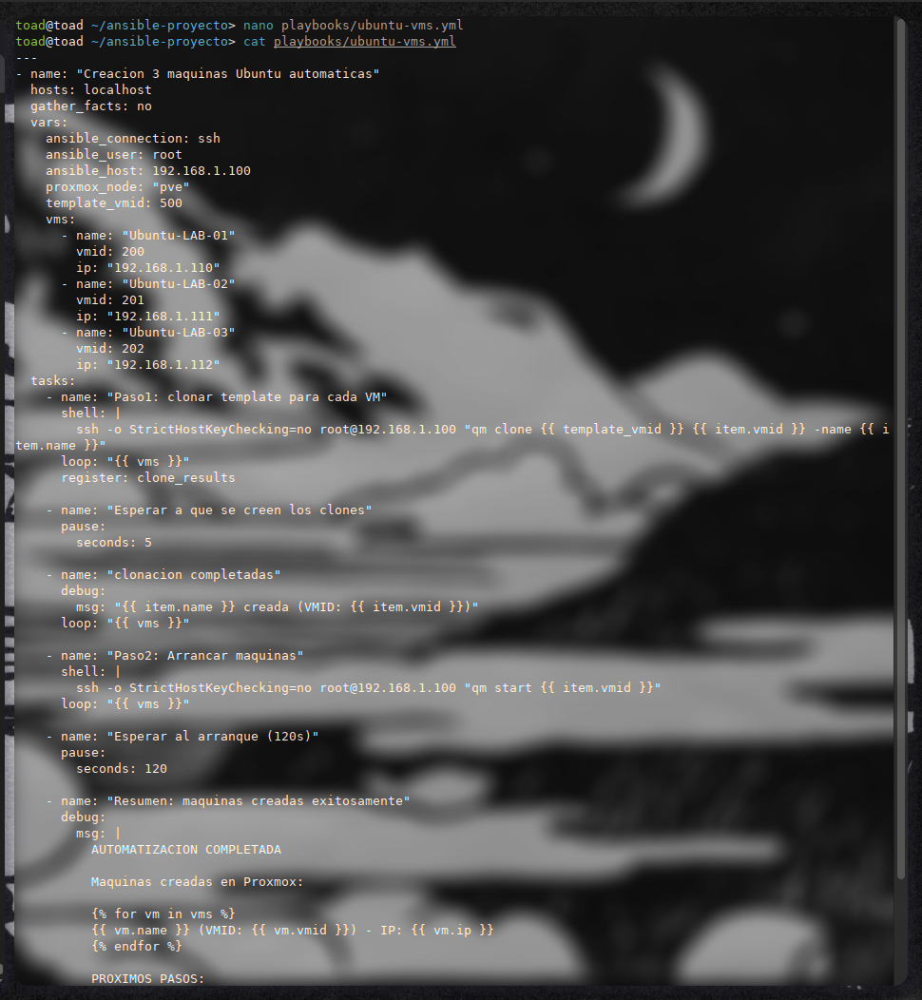

El playbook contiene 5 tareas principales:

1. **Clonar template**: Crea 3 nuevas VMs basadas en el template (VMID 500)
2. **Esperar clonación**: Pausa para permitir que se completen los clones
3. **Debug clonación**: Muestra confirmación de VMs creadas
4. **Arrancar máquinas**: Inicia automáticamente las 3 VMs
5. **Resumen**: Muestra información de las máquinas creadas

#### Paso 7: Instalar dependencias

Se instalan las librerías Python necesarias para conectar con la API de Proxmox:

> Instalación de dependencias (proxmoxer y requests)

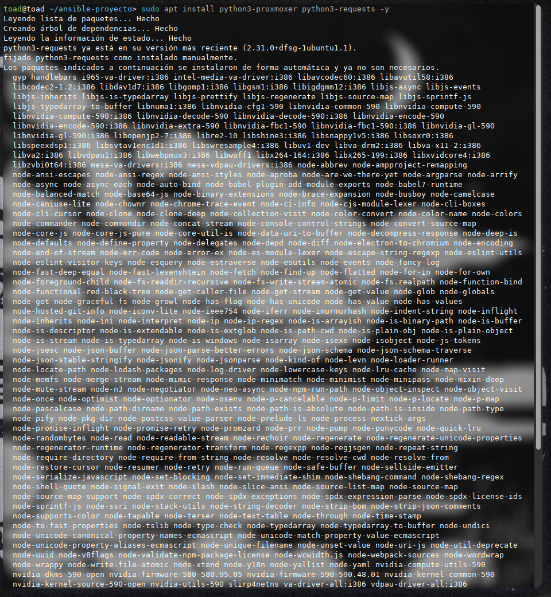

```bash
sudo apt install python3-proxmoxer python3-requests -y
```

### Ejecución del Playbook

Se ejecuta el playbook con el comando:

```bash
ansible-playbook playbooks/ubuntu-vms.yml -v
```

La ejecución tarda aproximadamente 5-6 minutos y realiza lo siguiente:

1. **Clonación** (~2-3 minutos): Copia el template 3 veces
2. **Arranque** (~1 minuto): Inicia las 3 VMs
3. **Espera** (120 segundos): Aguarda a que las VMs carguen completamente
4. **Resumen** (~5 segundos): Muestra información de las máquinas creadas

#### Ejecución en tiempo real

> Playbook ejecutándose - Clonación y arranque de VMs

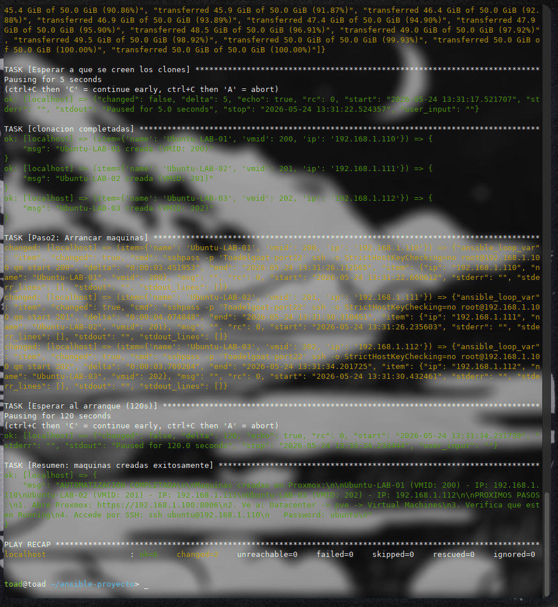

Se observa el progreso:
- `changed: [pve]` para cada tarea que modifica el estado
- Output en verde indica ejecución exitosa
- Pausas planificadas funcionando correctamente

#### Verificación en Proxmox

> Las 3 VMs creadas y en estado Running en Proxmox UI

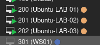

Las máquinas aparecen inmediatamente en el interfaz de Proxmox:
- Ubuntu-LAB-01 (VMID 200) - 192.168.1.110 - Running
- Ubuntu-LAB-02 (VMID 201) - 192.168.1.111 - Running
- Ubuntu-LAB-03 (VMID 202) - 192.168.1.112 - Running

### Validación de Funcionamiento

#### Acceso SSH

Se verifica que las máquinas son accesibles por SSH:

> Conexión SSH exitosa a Ubuntu-LAB-01

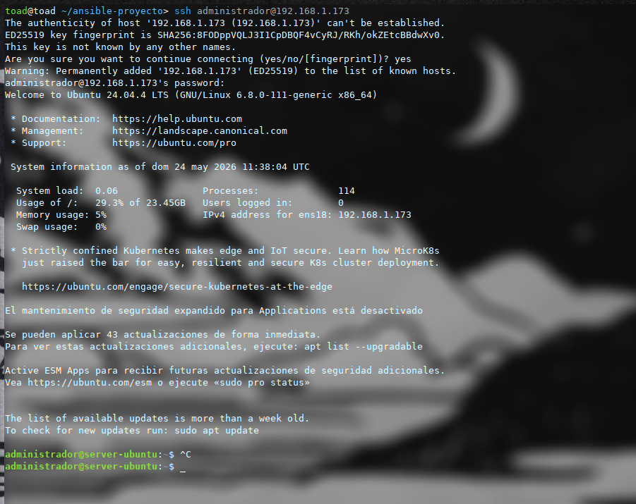

```bash
ssh ubuntu@192.168.1.110
# Password: ubuntu
```

#### Verificación interna

Dentro de la máquina se verifica funcionalidad:

> Información del sistema y conectividad de red

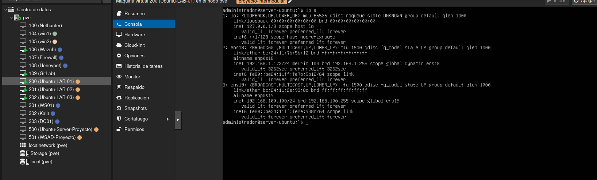

```bash
# Verificar hostname
hostname
# Output: Ubuntu-LAB-01

# Verificar IP asignada
ip addr show
# Output: inet 192.168.1.110/24 brd 192.168.1.255

# Verificar version del sistema
uname -a
# Output: Linux Ubuntu-LAB-01 5.15.0-...
```

Las máquinas están completamente funcionales y conectadas a la red.

### Resultados

| Máquina | VMID | IP | Estado | Acceso SSH |
|---------|------|----|---------|-----------| 
| Ubuntu-LAB-01 | 200 | 192.168.1.110 | Running | OK |
| Ubuntu-LAB-02 | 201 | 192.168.1.111 | Running | OK |
| Ubuntu-LAB-03 | 202 | 192.168.1.112 | Running | OK |

**Tiempo total de ejecución**: ~5-6 minutos
**Tiempo manual equivalente**: ~45 minutos
**Mejora de eficiencia**: 80% reducción en tiempo

### Ventajas de esta Automatización

1. **Velocidad**: 3 VMs en 5 minutos vs 45 minutos manualmente (reducción del 80%)

2. **Consistencia**: Las máquinas se crean idénticamente cada vez que se ejecuta el playbook

3. **Reproducibilidad**: El código YAML puede versionarse en Git y ejecutarse en cualquier momento

4. **Escalabilidad**: Agregar más máquinas es tan simple como añadir líneas al archivo de variables

5. **Infrastructure as Code (IaC)**: La infraestructura se define como código, permitiendo:
   - Versionado en sistemas de control (Git)
   - Revisión de cambios (code review)
   - Documentación automática
   - Recuperación ante desastres (disaster recovery)

6. **Demanda**: Ansible es una skill altamente demandada en:
   - Roles de Security Engineer
   - Equipos DevOps
   - Administración de infraestructura
   - Automatización de seguridad

<div style="page-break-after: always;"></div>

---

## pfSense – Firewall y seguridad de red

### Descripción

pfSense es un sistema operativo basado en FreeBSD orientado específicamente a funcionar como **firewall** y **router**. En este proyecto se virtualiza sobre Proxmox como una máquina más de la infraestructura, actuando como punto de control y seguridad entre la red interna del servidor y el exterior.

La elección de pfSense se debe a que es una de las soluciones de firewall de código abierto más utilizadas tanto en entornos domésticos como empresariales. Su interfaz web (**WebConfigurator**) permite gestionar todas las reglas de cortafuegos, interfaces de red y servicios de forma intuitiva sin necesidad de conocer en profundidad el sistema FreeBSD subyacente. Además, cuenta con una comunidad enorme y documentación extensa, lo que lo convierte en una opción muy sólida tanto para entornos de laboratorio como de producción.

---

### Instalación de pfSense

#### Primer arranque

La instalación de pfSense comienza desde la imagen ISO montada en la máquina virtual de Proxmox. Al arrancar aparece el menú de boot donde se selecciona la opción por defecto (**Boot Multi user**) para iniciar el proceso de instalación.

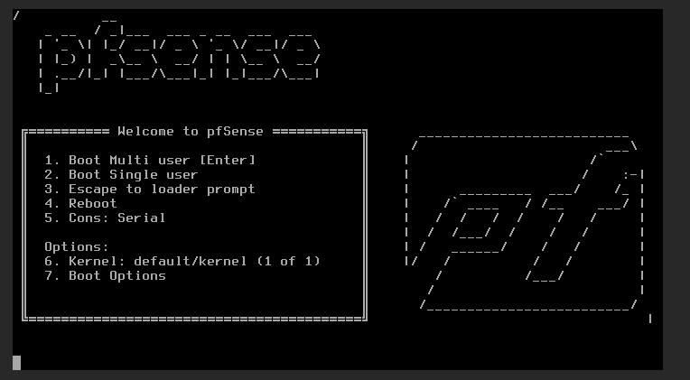

> Pantalla de bienvenida del instalador de pfSense con las opciones de arranque disponibles.

#### Proceso de instalación

El instalador extrae automáticamente los archivos del sistema operativo. El proceso tarda pocos minutos dependiendo del almacenamiento asignado a la máquina virtual.

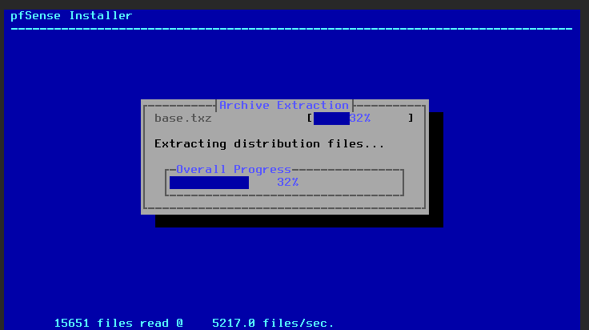

> Progreso de la extracción de archivos del sistema durante la instalación de pfSense.

---

### Configuración inicial de interfaces (Consola)

Una vez instalado el sistema, pfSense arranca e inicia la configuración de las interfaces de red. Esta parte se realiza directamente desde la consola, antes de acceder al panel web.

#### Detección de interfaces

Al detectar que las interfaces configuradas en la imagen no coinciden con las disponibles en la VM (el sistema esperaba `em0` y `em1` pero el adaptador VirtIO se llama `vtnet0`), pfSense lanza automáticamente el proceso de reasignación. Se responde `n` a la pregunta de configurar VLANs y se usa `a` para que el sistema detecte automáticamente la interfaz WAN.

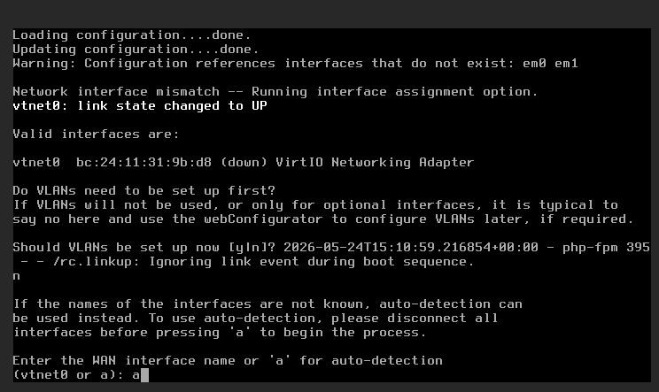

> Configuración inicial de interfaces por consola. El sistema detecta el adaptador VirtIO (`vtnet0`) y solicita asignar qué interfaz actuará como WAN.

#### Sistema arrancado – menú principal

Tras la configuración inicial de interfaces, pfSense arranca completamente con todos sus servicios activos y muestra el menú principal de consola. En este punto, la interfaz WAN tiene una IP asignada por DHCP (`192.168.100.12/24`) de forma temporal.

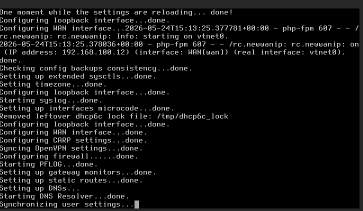

> Proceso de arranque del sistema con todos los servicios iniciándose correctamente: WAN, firewall, DNS Resolver, CARP, syslog, etc.

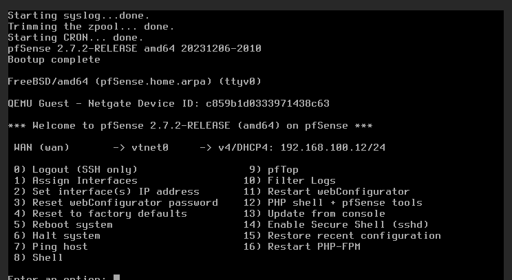

> Menú principal de pfSense en consola (versión **2.7.2-RELEASE**). Se puede ver la WAN con IP `192.168.100.12/24` asignada por DHCP y todas las opciones de administración disponibles.

#### Configuración de IP estática en la interfaz WAN

Desde el menú principal se selecciona la opción **2 (Set interface(s) IP address)** para asignar una IP estática a la interfaz WAN. El firewall necesita una dirección fija para ser siempre localizable en la red, por lo que se configura la IP `192.168.100.3` con máscara `/24`.

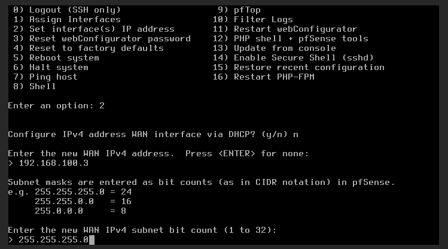

> Configuración de la IP estática de la interfaz WAN: se introduce `192.168.100.3` como dirección IPv4 y la máscara de subred `/24` (255.255.255.0).

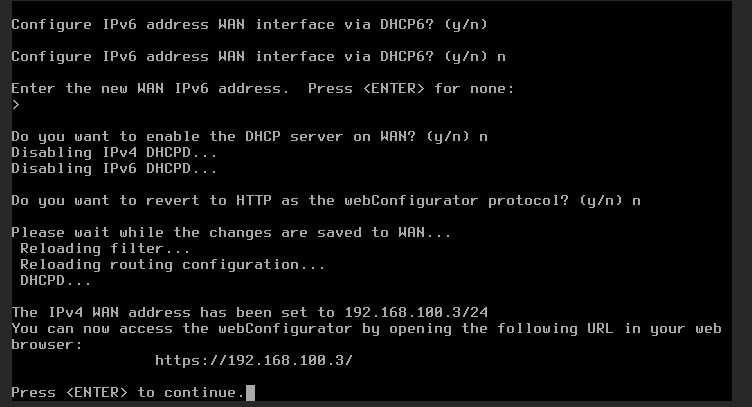

> Finalización de la configuración WAN estática: se descarta IPv6 por DHCP, se mantiene el servidor DHCP desactivado en WAN y se conserva HTTPS para el WebConfigurator. La IP queda fijada definitivamente en `192.168.100.3/24`.

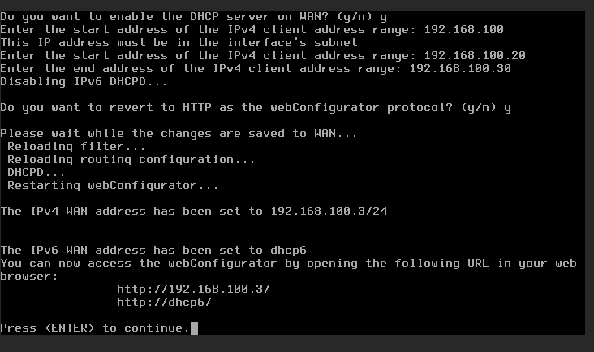

> En una segunda pasada por la configuración se habilita el servidor DHCP en WAN con rango `192.168.100.20–192.168.100.30` y acceso HTTP al WebConfigurator, lo que permite una primera conexión cómoda desde la red local antes de aplicar las restricciones de seguridad finales.

#### Instalación de Tailscale

Desde la opción **8 (Shell)** del menú principal se instala el paquete **Tailscale** mediante el gestor de paquetes nativo de FreeBSD. Tailscale es una VPN mesh que permite acceso remoto seguro al firewall sin necesidad de abrir puertos adicionales en la red, muy útil para administración desde fuera de la red local.

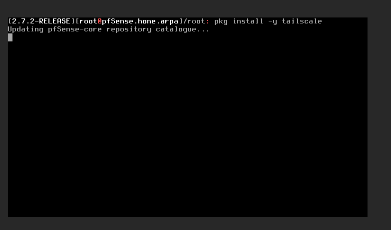

> Instalación de Tailscale desde la shell de pfSense con el comando `pkg install -y tailscale`.

---

### Configuración via WebConfigurator

Con la IP estática fijada, se accede al panel de administración web de pfSense desde un navegador en la red local (`https://192.168.100.3/`). Al entrar por primera vez, el sistema lanza automáticamente un asistente de configuración inicial de 9 pasos.

#### Paso 1: Bienvenida al asistente

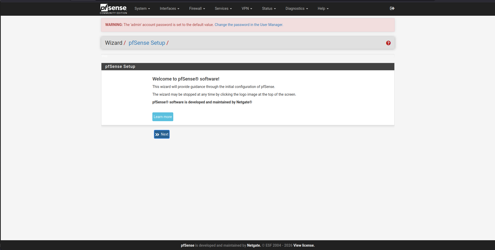

> Pantalla de bienvenida del asistente de configuración inicial (pfSense Setup Wizard). El sistema advierte que la contraseña del administrador sigue siendo la predeterminada y que debe cambiarse.

#### Paso 2: Información general

Se configura el nombre del host (`pfSense`), el dominio interno (`smr.local`) y el servidor DNS primario (`192.168.100.100`), que corresponde al servidor Ubuntu que actúa como DNS en la infraestructura.

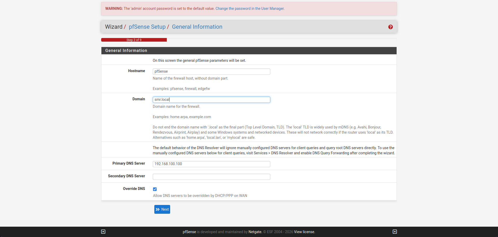

> Configuración del hostname `pfSense`, dominio `smr.local` y DNS primario apuntando al servidor Ubuntu (`192.168.100.100`).

#### Paso 3: Servidor de tiempo (NTP)

Se mantiene el servidor NTP por defecto de pfSense y se selecciona `Europe/Madrid` como zona horaria, la adecuada para el entorno del proyecto.

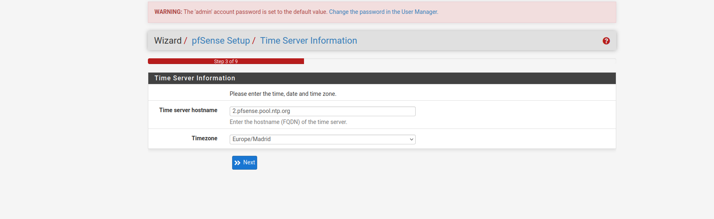

> Configuración del servidor NTP (`2.pfsense.pool.ntp.org`) y zona horaria `Europe/Madrid`.

#### Paso 4: Configuración de la interfaz WAN

Se confirma y aplica la configuración de la interfaz WAN con IP estática. Se introduce la dirección `192.168.100.3`, máscara `/24` y la puerta de enlace `192.168.100.100`.

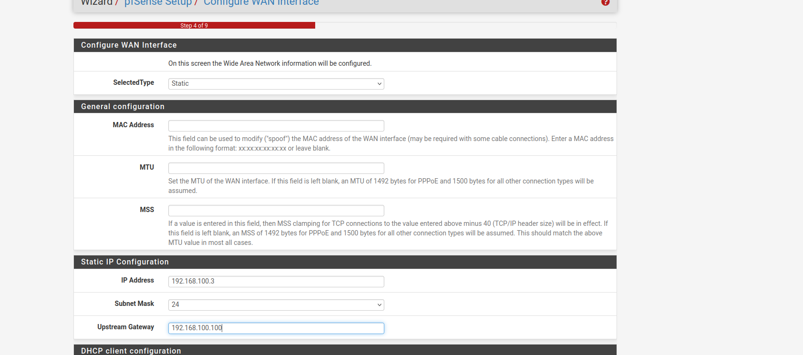

> Configuración de la interfaz WAN como estática: IP `192.168.100.3`, máscara `/24` y upstream gateway `192.168.100.100`.

#### Paso 5: Contraseña de administrador

Se establece una contraseña segura para el usuario `admin` del WebConfigurator. Este paso es fundamental ya que pfSense advierte desde el primer acceso que la contraseña por defecto debe cambiarse cuanto antes.

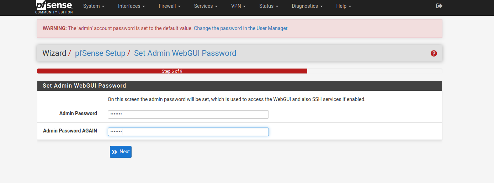

> Establecimiento de la contraseña de administrador para el acceso al WebConfigurator y SSH.

#### Paso 6: Asistente completado

Al finalizar los 9 pasos, pfSense confirma que la configuración inicial ha sido aplicada y el sistema está listo para su uso.

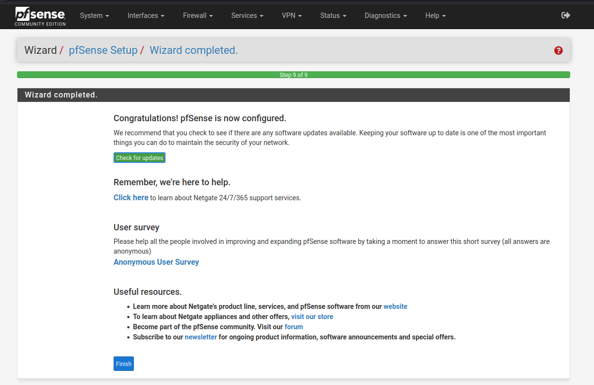

> Pantalla final del asistente de configuración (paso 9/9): pfSense queda configurado y operativo.

---

### Dashboard

Una vez completado el asistente, se accede al dashboard principal donde se puede ver toda la información del sistema: versión del software, interfaces de red activas con sus IPs, uptime, servidores DNS configurados y el estado general del firewall.

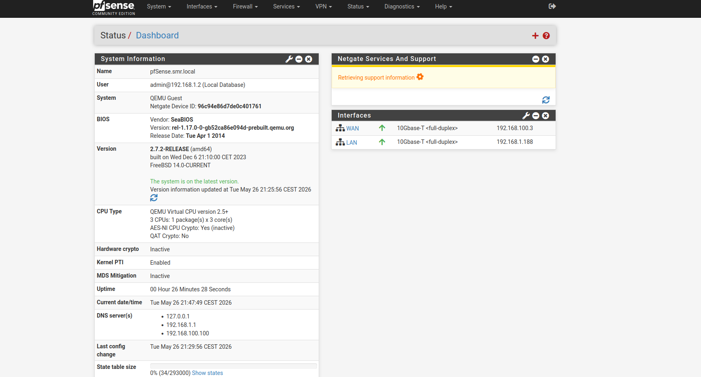

> Dashboard de pfSense tras la configuración inicial. Se observan las interfaces WAN (`192.168.100.3`) y LAN (`192.168.1.188`) activas, los servidores DNS y la información del sistema virtualizado sobre QEMU.

---

### Configuración del Firewall – Reglas WAN

La parte más importante de pfSense es la gestión de las reglas del cortafuegos. Se configuran reglas en la interfaz **WAN** para controlar exactamente qué tráfico está permitido hacia los servidores internos y qué se bloquea.

La política aplicada sigue el principio de **mínimo privilegio**: se permite únicamente el tráfico estrictamente necesario para el funcionamiento de los servicios y se bloquea todo lo demás por defecto.

#### Regla 1: Permitir DNS desde WAN al servidor Ubuntu

Se crea una regla que permite el tráfico **UDP** en el puerto **53 (DNS)** desde la red `192.168.100.0` hacia el servidor Ubuntu (`192.168.100.100`), para que los clientes de la red puedan resolver nombres a través del servidor DNS de la infraestructura.

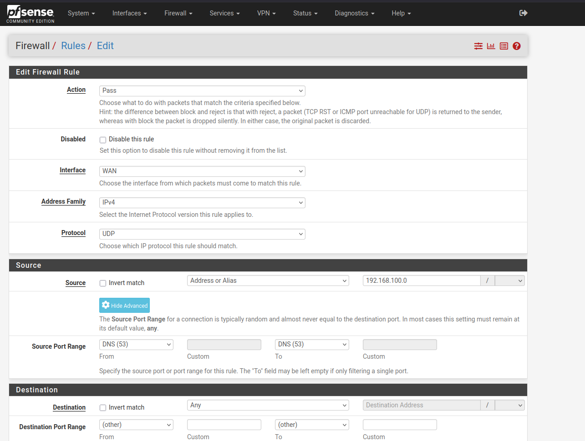

> Configuración de la regla de firewall para permitir tráfico DNS (UDP puerto 53) desde la red WAN hacia el servidor Ubuntu. Se especifican la interfaz WAN, el protocolo UDP y los puertos de origen y destino.

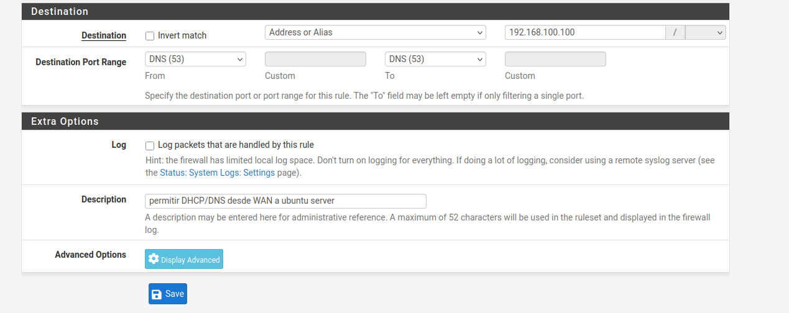

> Detalle del destino de la regla DNS: tráfico dirigido a `192.168.100.100` (servidor Ubuntu) en el puerto 53. La descripción `"permitir DHCP/DNS desde WAN a ubuntu server"` deja claro el propósito de la regla.

#### Regla 2: Permitir SSH al servidor Ubuntu

Se crea una regla que permite el tráfico **TCP** en el puerto **22 (SSH)** desde la red `192.168.100.0` hacia el servidor Ubuntu (`192.168.100.100`), necesaria para poder administrar el servidor de forma remota a través del firewall.

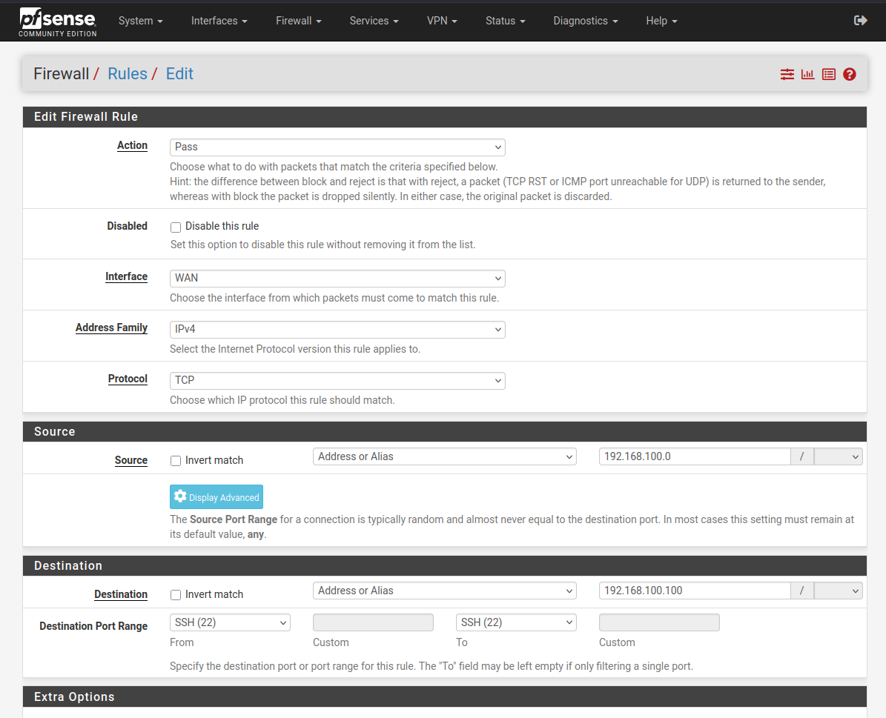

> Configuración de la regla de firewall para permitir SSH (TCP puerto 22) desde la red `192.168.100.0` hacia el servidor Ubuntu `192.168.100.100`.

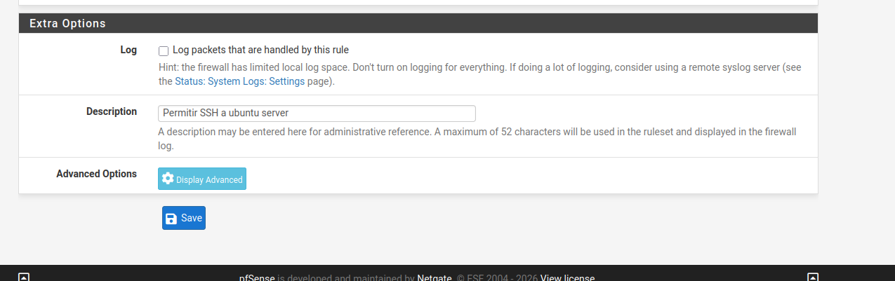

> Descripción de la regla SSH: `"Permitir SSH a ubuntu server"`. Una vez guardada, esta regla permite la administración remota del servidor de forma controlada y segura.

#### Regla 3: Denegación por defecto

La última regla es una regla de **bloqueo total** que actúa como política de seguridad por defecto: cualquier tráfico que no haya sido permitido explícitamente por las reglas anteriores será descartado silenciosamente. Esta regla es la que garantiza que el firewall no deje pasar nada que no hayamos autorizado de forma explícita.

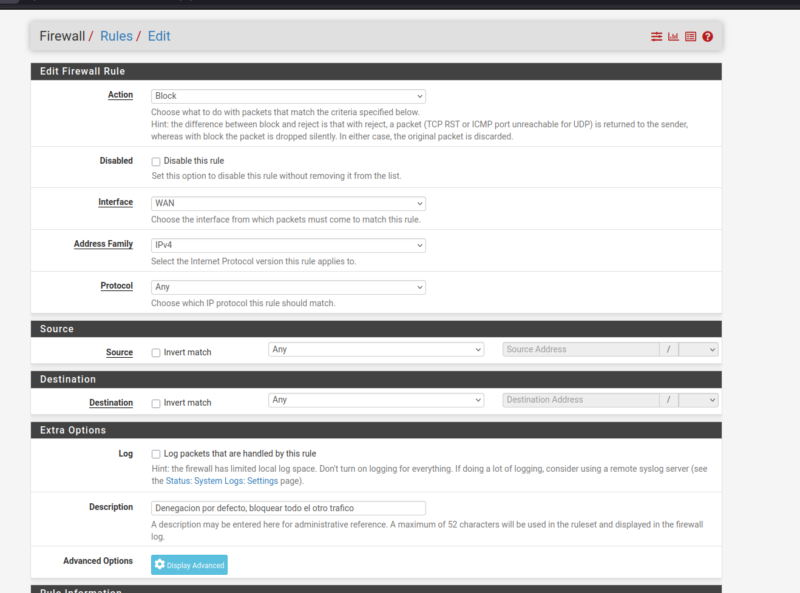

> Regla de denegación por defecto: acción **Block**, protocolo **Any**, origen y destino **Any**. Descripción: `"Denegacion por defecto, bloquear todo el otro trafico"`.

---

### Resultado final de las reglas

Con las tres reglas configuradas, el firewall queda con la siguiente política de acceso en la interfaz WAN:

| Acción | Protocolo | Origen | Destino | Puerto | Descripción |
|--------|-----------|--------|---------|--------|-------------|
| Block | - | Reserved/Bogon | * | * | Block bogon networks (por defecto) |
| Block | IPv4 Any | Any | Any | * | Denegación por defecto |
| Pass | IPv4 TCP | 192.168.100.0 | 192.168.100.100 | 22 (SSH) | Permitir SSH a ubuntu server |
| Pass | IPv4 UDP | 192.168.100.0 | 192.168.100.100 | 53 (DNS) | Permitir DHCP/DNS desde WAN |

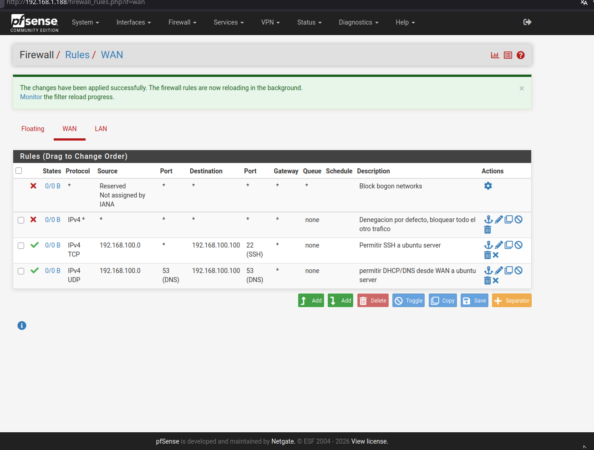

> Vista final de las reglas WAN en pfSense con los cambios aplicados correctamente. Se observan las cuatro reglas activas: bloqueo de redes bogon, denegación por defecto, permiso de SSH y permiso de DNS hacia el servidor Ubuntu.

<div style="page-break-after: always;"></div>

---

## Web – Página corporativa con Web4Pro

### Descripción

"M"e gustaria que destacar que esta pagina web la he hecho para la empresa en la que estaba haciendo mis practicas laborales y esta 100% operativa"

Como parte del proyecto, se desarrolla una página web corporativa utilizando el CMS **Web4Pro**. Este gestor de contenidos permite crear y administrar páginas web de forma sencilla y profesional, sin necesidad de programar desde cero, adaptándose perfectamente a las necesidades de una pequeña o mediana empresa.

La página web de la empresa es de acceso público y puede visitarse buscando **"piezasdeinformatica"** en cualquier navegador.

---

### Layout de la página

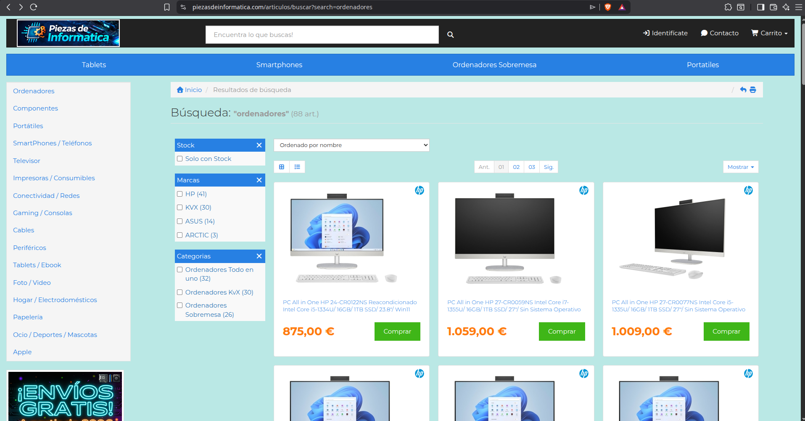

> Vista general del layout de la página web corporativa, donde se puede apreciar la estructura y disposición de los elementos que componen la web.

<div style="page-break-after: always;"></div>

---

## **Conclusion**

Este proyecto ha supuesto la puesta en práctica de numerosos conocimientos adquiridos a lo largo del ciclo formativo de Sistemas Microinformáticos y Redes, integrando tanto hardware como software en una infraestructura real y funcional.

Desde el montaje físico del servidor con componentes reciclados hasta la configuración de servicios de red avanzados, cada fase del proyecto ha presentado sus propios retos y aprendizajes:

- La configuración del **servidor Ubuntu** con DNS y DHCP me permitió profundizar en la administración de sistemas Linux, en el funcionamiento de los protocolos de red y en la importancia de una correcta planificación del direccionamiento IP en una red empresarial.

- La implementación de **Active Directory** en Windows Server fue especialmente significativa, ya que es una tecnología ampliamente utilizada en el mundo laboral. Comprender cómo funciona la gestión centralizada de usuarios, equipos y políticas me ha dado una perspectiva más clara de cómo se administran las redes empresariales reales.

- Esta solución de automatización demuestra cómo Ansible mejora significativamente la eficiencia operacional, un aspecto crítico en entornos empresariales y de ciberseguridad. La capacidad de provisionar infraestructura de forma rápida, consistente y reproducible es fundamental en diferentes ambitos desde la ciberseguridad hasta infraestructura en una red 

- La implementacion de un **firewall** con pfsense fue sin duda la parte que mas me apasiono de este proyecto, ya que he aprendido a gestionar reglas de un firewall que se podria usar de manera profesional

- El desarrollo de la **página web** con un CMS en mi estadia en la empresa me ayudo a ganar experiencia en el ambito de el desarroyo web.

- El uso de **hardware reciclado** no solo supuso un ahorro económico considerable, sino que también reforzó la conciencia sobre la sostenibilidad en el sector tecnológico.

En resumen, este proyecto representa una solución integral, realista y económica que podría perfectamente ser implantada en una pequeña o mediana empresa, cumpliendo con los requisitos de gestión de red, seguridad, presencia web y administración centralizada de usuarios.

<div style="page-break-after: always;"></div>

## **Glosario**

### Hardware

A continuación se muestran imágenes del hardware utilizado en el servidor. Todos los componentes han sido reciclados o adquiridos de segunda mano, manteniendo un funcionamiento óptimo.

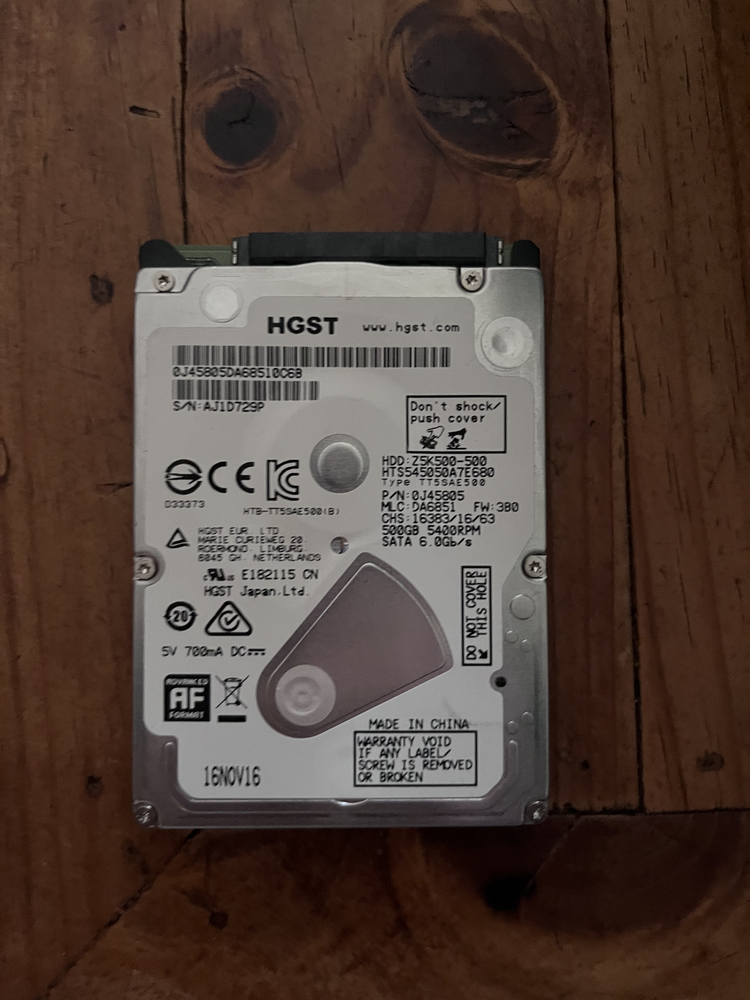

> Vista general del interior del equipo servidor con los componentes montados.

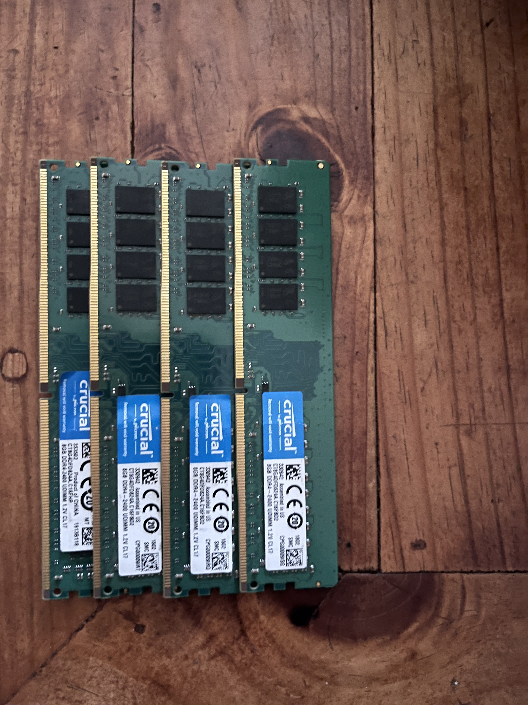

> Detalle de la placa base Gigabyte GA-AB350-Gaming 3 con el procesador AMD Ryzen 5 3400G instalado.

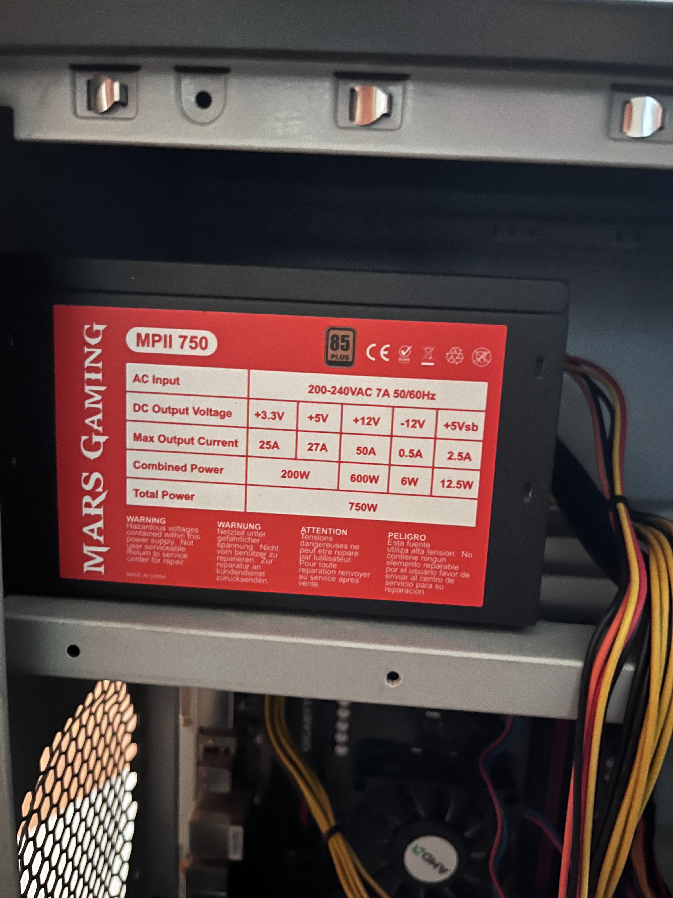

> Módulos de memoria RAM DDR4 instalados en la placa base (32 GB en total).

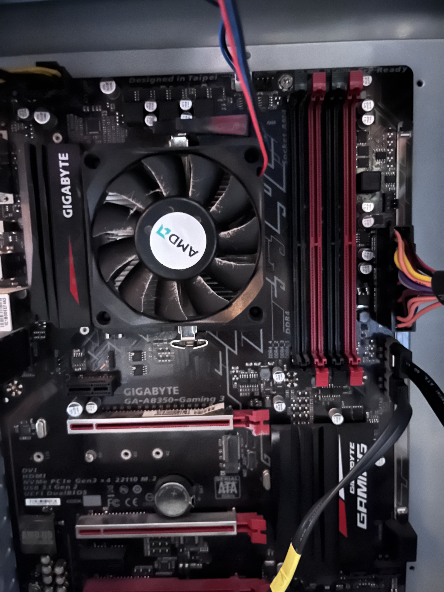

> Vista del conjunto completo: fuente de alimentación 750W 80 Plus Bronze, SSD de 500 GB y cableado interno del equipo.

---

-- Trabajo hecho y maquetado por Jairo Mosteiro campos con motivo de su proyecto intermodular en SMR
